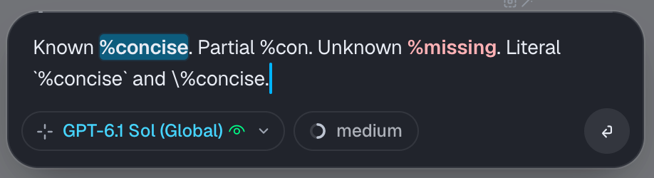
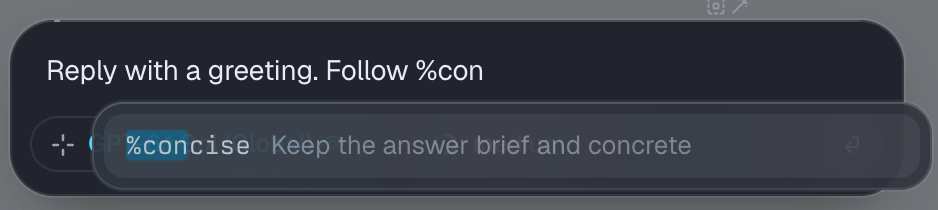
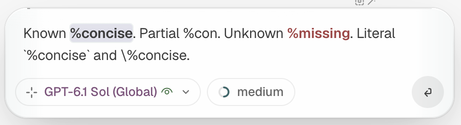

# omp inline snippets

Use short, named instructions anywhere in an [omp](https://omp.sh/) prompt.

```text
Review this change. Follow %minimal_change and %concise.
```

References stay compact while you write. When you submit, the extension adds their full instructions to the message. The model receives the text, not an unexplained shortcut.



## Install

Requires omp. Tested with **omp 18.6.0** and Bun 1.4.0. This is an omp extension, not a standalone program or a Pi extension.

```sh
omp install github:Jaleel-VS/omp-inline-snippets
```

Start a new omp session after installing. Existing sessions do not reload extension code.

Installation does not create or overwrite your prompt files. Add a snippet as described below, then use it in any normal prompt.

## Create your first snippet

Create the directory if it does not exist:

```sh
mkdir -p ~/.omp/agent/prompts
```

Save this as `~/.omp/agent/prompts/concise.md`:

```markdown
---
description: Keep the answer brief and concrete
---
Keep the answer brief and concrete. Put the conclusion first; include only relevant evidence and risks.
```

In omp, enter `/snippets` to load it for autocomplete. Then write:

```text
Explain this function. Follow %concise.
```

The filename is the snippet name. `concise.md` becomes `%concise`. The optional `description` appears in autocomplete.

More examples are included in [`examples/`](examples/). Copy the files you want into your prompt directory. Do not overwrite existing files unless you intend to replace their instructions.

## Autocomplete and highlighting

Type `%` or a partial name such as `%con` to open suggestions automatically. Use the arrow keys to choose a match and **Tab** to accept it. **Escape** dismisses the suggestions without changing your draft; typing more of the name opens them again. Selecting a suggestion inserts the compact reference, not the full instructions. Tab can also reopen suggestions manually.



| Reference | Appearance |
| --- | --- |
| Known name, such as `%concise` | Bold, with a theme-aware highlight |
| Partial name, such as `%con` | Plain text while it matches a possible name |
| Unknown name, such as `%missing` | Error color |
| Reference inside code, or escaped with a backslash | No snippet styling |

Highlighting works in ordinary ANSI terminals and [Tern](https://stencil.so/tern)'s native composer. It does not change the text: cursor movement, selection, copying, and character deletion still work normally. Shell and Python composer modes bypass snippet styling.



## What gets sent

This draft:

```text
Explain this function. Follow %concise.
```

is sent with a definitions section:

```text
Explain this function. Follow %concise.

Referenced instructions (apply the definitions below to the references in this message):
%concise:
Keep the answer brief and concrete. Put the conclusion first; include only relevant evidence and risks.
```

The expanded message is visible in conversation history. Each referenced definition is added once, in first-use order. There is no extra model call or tool lookup.

These are user instructions, not system rules. The extension resolves references; it cannot guarantee model compliance or make a rule permanently active.

## Where snippets live

| Scope | Directory |
| --- | --- |
| All projects | `~/.omp/agent/prompts/` |
| Current project | `<working-directory>/.omp/prompts/` |

If `PI_CODING_AGENT_DIR` is set, its `prompts/` directory replaces the default global directory.

Nested directories are supported, but only the filename defines the name. Use unique filenames across all directories and scopes. Duplicate names are errors, not silent overrides.

Names start with a letter or underscore. They may contain letters, numbers, underscores, and hyphens. Names are case-sensitive; autocomplete searches prefixes without regard to case.

The same Markdown files also work as omp's native `/name` prompt templates. Native templates must start the message; this extension lets you use `%name` inside ordinary prose.

## Editing and reloading

- **Submission rereads the files**, so edited instructions are used immediately.
- Use **`/snippets`** to refresh autocomplete and list the loaded snippets.
- Restart omp after changing the extension's source code.
- Native `/name` prompt templates have their own loading behavior; restart omp to refresh those.

Snippet bodies are literal text. The extension does not evaluate Handlebars, substitute arguments, or recursively expand references inside a snippet. Use short instruction snippets rather than parameterized prompt templates.

## Literal text and errors

To mention a snippet without applying it, write `\%concise`. The backslash is removed when the message is sent.

References inside backtick code spans, backtick or tilde fenced blocks, and URL/path-embedded tokens are left alone. Ordinary percentages such as `90%` are not references.

An unknown name stops submission and restores your draft with an error notification. Empty snippet files, invalid YAML, and duplicate names are also errors. Fix the file or reference, then try again.

## Change the trigger

```sh
omp --snippet-prefix '&'
```

The default is `%`. Only one trigger is active per session. It must be one punctuation character, excluding `/`, `\`, and backtick.

## Development

Requires Bun. Clone the repository, install dependencies, and run the checks:

```sh
git clone https://github.com/Jaleel-VS/omp-inline-snippets.git
cd omp-inline-snippets
bun install --frozen-lockfile
bun test
bun run check
```

Load the extension for one session:

```sh
omp --extension .
```

Or link it for regular use:

```sh
omp plugin link .
```

Restart omp to load source changes. Development dependency versions are pinned to the omp version used for verification. `bun.lock` is tracked; generated `target/` files and `node_modules/` are ignored.

## Verification and limits

Verified with eleven behavioral tests, TypeScript checking, actual ANSI rendering, and Tern light/dark rendering. The live omp flow covered automatic suggestions without Tab, Escape dismissal, compact selection, literal-reference suppression, normal backspace, expanded submission with a model response, and unknown-reference rejection with draft preservation. Regression tests also cover native text edits and precedence over prose word-completion ghosts.

The supported workflow is interactive omp. Print, RPC, ACP, and subagent modes have not been verified. Styling uses omp's custom-editor API; another extension that replaces the editor may conflict with it.

Extensions run inside omp with its process privileges. This extension reads local prompt files and decorates the composer. It does not make network requests, execute snippet bodies, or write your prompt files.
